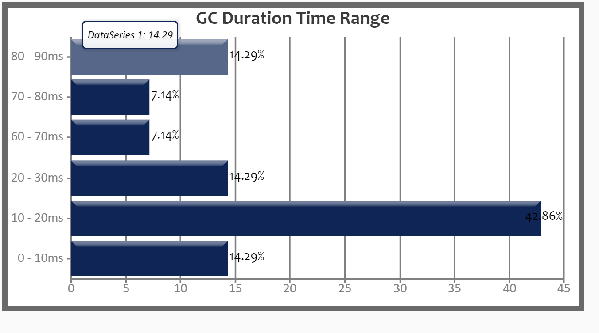
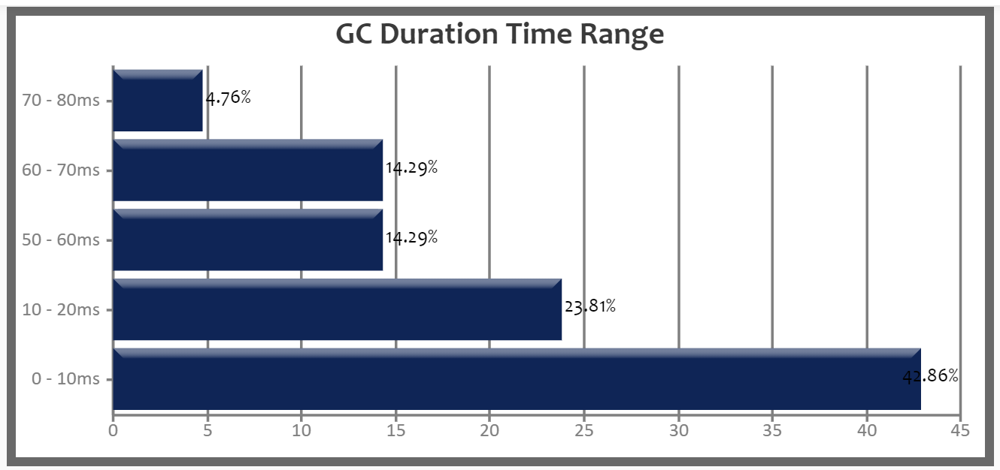
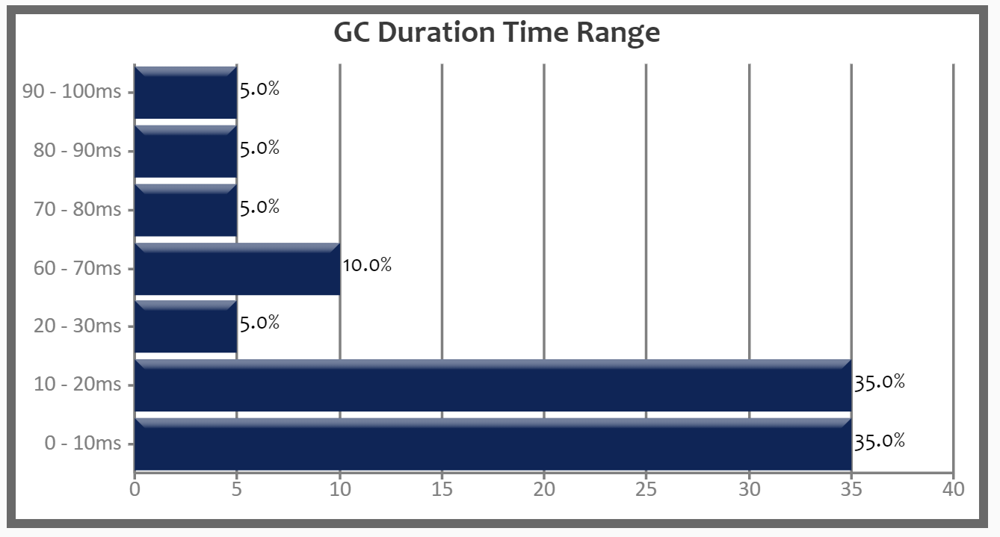
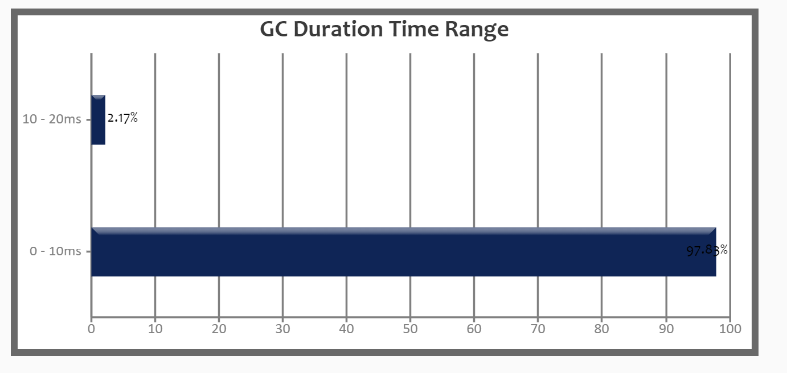

学习笔记

###1、 使用 GCLogAnalysis.java 自己演练一遍串行/并行/CMS/G1的案例

串行   
java -XX:+UseSerialGC -XX:-UseAdaptiveSizePolicy -XX:+PrintGCDetails -Xms512m -Xmx512m -Xloggc:gc.serial.demo.log  GCLogAnalysis    
执行结束!共生成对象次数:7460    
[serial-logfile](./gclog/gc.serial.demo.log)


并行   
java -XX:+UseParallelGC -XX:-UseAdaptiveSizePolicy -XX:+PrintGCDetails -Xms512m -Xmx512m -Xloggc:gc.parallel.demo.log  GCLogAnalysis    
执行结束!共生成对象次数:8501    
[parallel-logfile](./gclog/gc.parallel.demo.log)


CMS    
java  -XX:-UseAdaptiveSizePolicy -XX:+PrintGCDetails -Xms512m -Xmx512m -Xloggc:gc.cms.demo.log -XX:+UseConcMarkSweepGC  GCLogAnalysis    
执行结束!共生成对象次数:8547   
[cms-logfile](./gclog/gc.cms.demo.log)



G1   
java  -XX:-UseAdaptiveSizePolicy -XX:+PrintGCDetails -Xms512m -Xmx512m -Xloggc:gc.g1.demo.log -XX:+UseG1GC  GCLogAnalysis     
执行结束!共生成对象次数:8154   
[g1-logfile](./gclog/gc.g1.demo.log)



####2使用压测工具（wrk或sb） ， 演练gateway-server-0.0.1-SNAPSHOT.jar示例

```
java -jar -XX:+UseSerialGC -Xmx512m -Xms512m gateway-server-0.0.1-SNAPSHOT.jar
.\sb -u http://192.168.0.106:8088/api/hello -c 40 -N 30
Starting at 2021/1/24 2:35:12
[Press C to stop the test]
43448   (RPS: 1214.4)
---------------Finished!----------------
Finished at 2021/1/24 2:35:47 (took 00:00:35.8503891)
Status 200:    43450

RPS: 1398.6 (requests/second)
Max: 349ms
Min: 0ms
Avg: 7.2ms

  50%   below 5ms
  60%   below 7ms
  70%   below 9ms
  80%   below 11ms
  90%   below 15ms
  95%   below 18ms
  98%   below 23ms
  99%   below 26ms
99.9%   below 68ms

```

parallel    
```
java -jar -XX:+UseParallelGC -Xmx512m -Xms512m gateway-server-0.0.1-SNAPSHOT.jar
 .\sb -u http://192.168.0.106:8088/api/hello -c 40 -N 30
Starting at 2021/1/24 2:43:43
[Press C to stop the test]
46944   (RPS: 1327.9)
---------------Finished!----------------
Finished at 2021/1/24 2:44:18 (took 00:00:35.4676472)
Status 200:    46954

RPS: 1508.6 (requests/second)
Max: 323ms
Min: 0ms
Avg: 7.3ms

  50%   below 6ms
  60%   below 7ms
  70%   below 9ms
  80%   below 12ms
  90%   below 15ms
  95%   below 19ms
  98%   below 23ms
  99%   below 26ms
99.9%   below 69ms

```


cms    

```
java -jar -XX:+UseConcMarkSweepGC -Xmx512m -Xms512m gateway-server-0.0.1-SNAPSHOT.jar 

 .\sb -u http://192.168.0.106:8088/api/hello -c 40 -N 30
Starting at 2021/1/24 2:41:06
[Press C to stop the test]
53208   (RPS: 1489.9)
---------------Finished!----------------
Finished at 2021/1/24 2:41:42 (took 00:00:35.7752328)
Status 200:    53208

RPS: 1712.7 (requests/second)
Max: 87ms
Min: 0ms
Avg: 5.8ms

  50%   below 5ms
  60%   below 6ms
  70%   below 7ms
  80%   below 10ms
  90%   below 13ms
  95%   below 16ms
  98%   below 19ms
  99%   below 21ms
99.9%   below 31ms

```

G1

```
java -jar -XX:+UseG1GC -Xmx512m -Xms512m gateway-server-0.0.1-SNAPSHOT.jar
 .\sb -u http://192.168.0.106:8088/api/hello -c 40 -N 30
Starting at 2021/1/24 2:45:42
[Press C to stop the test]
53830   (RPS: 1524.4)
---------------Finished!----------------
Finished at 2021/1/24 2:46:17 (took 00:00:35.4145735)
Status 200:    53835

RPS: 1731.2 (requests/second)
Max: 136ms
Min: 0ms
Avg: 5.9ms

  50%   below 5ms
  60%   below 6ms
  70%   below 8ms
  80%   below 10ms
  90%   below 13ms
  95%   below 15ms
  98%   below 19ms
  99%   below 23ms
99.9%   below 72ms
```

总结
1.1 Xms 如果不设置性能会下降
1.2 g1停顿时间最佳，但创建对象不是最多的
1.3 parallel 和 CMS 创建对象最多， parallel总的gc时间比cms的少,但cms的单次gc时间相对比parallel 短

2 压测RPS cms 和g1 最好。小内存下CMS 的相应时间最好
 


